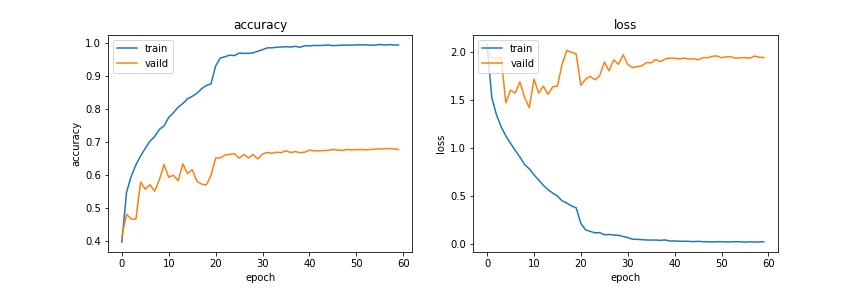
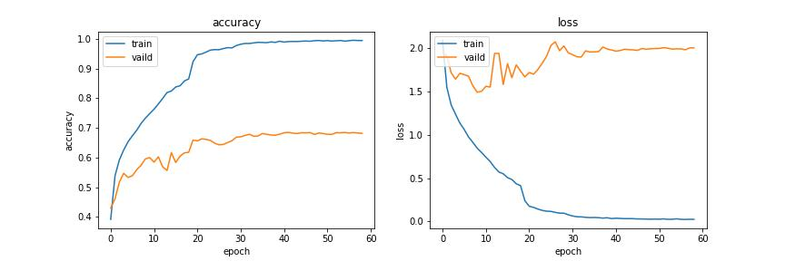

| experiment                                                                                                      | train.precision | valid.precision | test.precision |
| --------------------------------------------------------------------------------------------------------------- | --------------- | --------------- | -------------- |
| subset\_224\_efficientnetb3\_transfer\_trainable\_epochs100\_batchsize16\_lr0.0005\_reducelr\_dropout0          | 1.00000         | 0.71494         | 0.68902        |
| subset\_224\_efficientnetb0\_transfer\_trainable\_epochs100\_batchsize16\_lr0.0005\_reducelr\_dropout0          | 1.00000         | 0.71447         | 0.68643        |
| subset\_224\_efficientnetb3\_transfer\_trainable\_datagen\_epochs100\_batchsize16\_lr0.0005\_reducelr\_dropout0 | 0.98521         | 0.69711         | 0.67567        |
| subset\_224\_efficientnetb0\_transfer\_trainable\_datagen\_epochs100\_batchsize16\_lr0.0005\_reducelr\_dropout0 | 0.98353         | 0.68834         | 0.66721        |

## 2022.09.25 Efficientnetb0, Efficientnetb3

嘗試提高模型深度，但效果有限，使用 Efficientnetb0 在測試集的 WP 為 0.689，使用 Efficientnetb3 在測試集的 WP 為 0.686

顯示問題可能不在模型深度，而是資料特徵或是模型訓練的超參數，導致過擬合

Efficientnetb0  

Efficientnetb3  

## 2022.09.25 Data Augmentation

嘗試使用資料增強方法，沒有改善過擬合問題

Efficientnetb3 Data Augmentation
