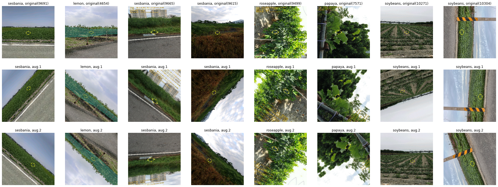
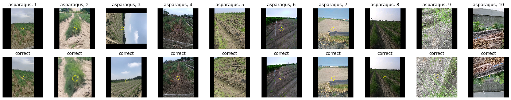
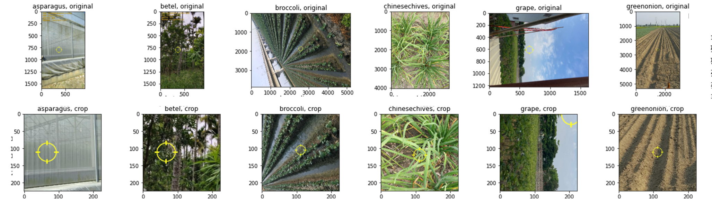
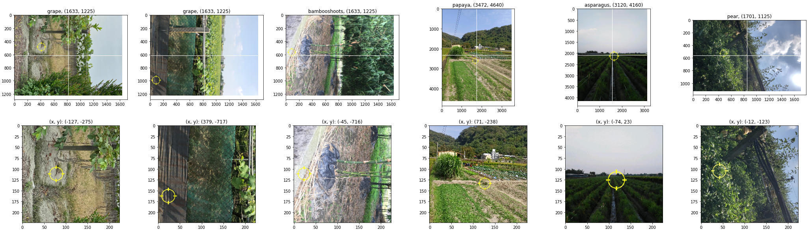
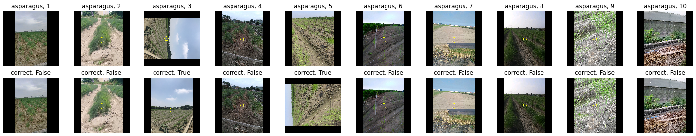
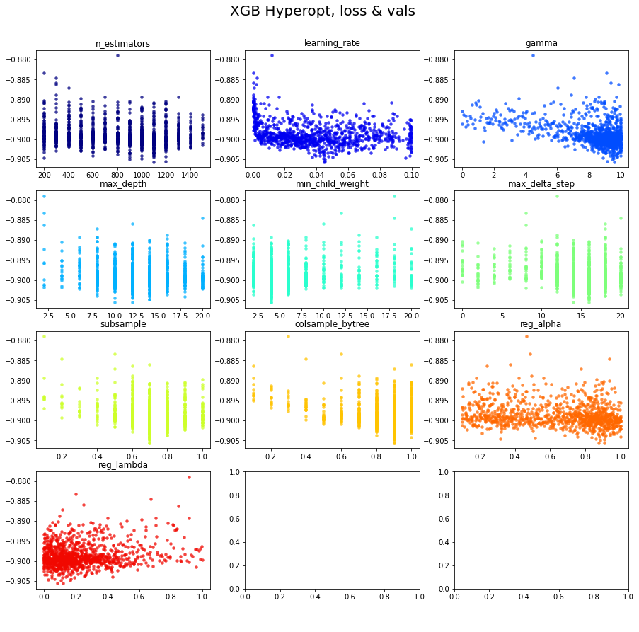
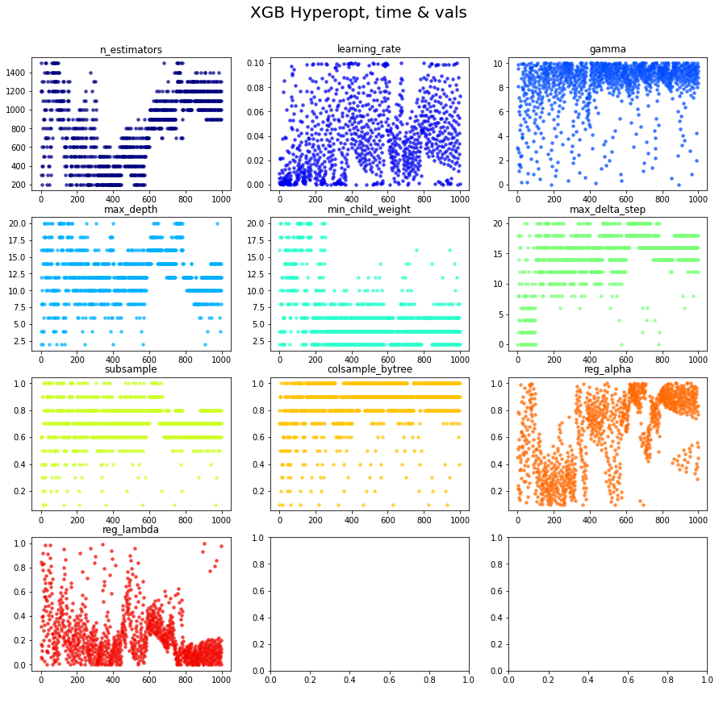

# Folder Structure

說明資料夾與程式檔案的用途

- `analysis` 存放資料分析的產出及程式檔案
- `data` 存放官方提供的資料及處理後的資料
- `image` 存放影像資料前處理的程式碼
- `logs` 存放模型訓練的紀錄檔案
- `models` 存放訓練完畢的模型及權重檔案
- `outputs` 存放各個階段的類別機率輸出檔案
- `sample` 存放少量影像樣本
- `submission` 存放 Public 及 Private 階段的提交檔案
- `utils` 存放公用程式
- `classification_binary_efficientnet.ipynb` 二元分類的深度學習模型程式
- `classification_multiclass_efficientnet.ipynb` 多類別的深度學習模型程式，這次競賽的主要模型
- `ensemble_xgb.ipynb` 集成模型的程式，這次競賽的次要模型
- `pre_processing.ipynb` 資料前處理程式，通常需要最先執行，不過目前會用到的資料都已經處理好了

# Method

說明主要的方法與架構，更多實驗細節紀錄在後續章節

## Data Pre-Processing

說明資料前處理的方法，程式實作參考 [pre_processing.ipynb](./pre_processing.ipynb) 檔案

- 從官方提供的經緯座標計算海拔高度，更多細節參考[資料描述](./data#train_tag_loc_coor_describe_elevationcsv)
- 從影像的 EXIF 提取角度、拍攝時間及相機型號等屬性，更多細節參考[資料描述](./data#train_tag_loc_coor_describecsv)
- 將類別欄位轉換為 One-Hot Encoding 格式，供模型訓練使用
- 使用從 EXIF 中提取的角度資訊來修正影像角度，參考[角度修正實驗](#Image-Angle-Correction-by-Rule)
- 使用官方提供的準心資訊作為中心點來裁剪影像，裁剪比例為 70%，參考[影像裁切實驗](#Image-Crop-by-XY)
- 調整影像大小，縮放到相同的解析度（224x224）
- 模型架構帶有[正規化效果](https://www.tensorflow.org/api_docs/python/tf/keras/applications/efficientnet)，直接輸入值域為 0 到 255 之間的向量

## Data Split

說明不同階段的資料拆分策略，對於資料的更多細部資訊可以參考[資料描述](./data#data-description)章節

- 在 Training 階段使用全部資料集的 20% 進行小規模快速實驗，資料總共 17899 筆，預先以 70%、15%、15% 的比例切分為訓練（Training）、驗證（Validation）與測試（Testing）資料集
- 在 Public 階段使用全部資料進行完整實驗，資料總共 89514 筆，預先以 85%、15% 的比例切分為訓練（Training）與驗證（Validation）資料集，並以 Public Submission 代替測試（Testing）資料集
- 在 Public 階段的 Ensemble 實驗，將各個 Deep Learning 模型在驗證集（Validation）的輸出用於訓練 Ensemble 模型，並從其中拆分 20% 用於超參數優化

## Deep Learning Method: EfficientNet

模型使用 EfficientNet 在 Keras 上基於 ImageNet 之預訓練模型作為特徵擷取器，模型的 Dropout 比例為 40%，預訓練模型的權重僅作為模型初始權重，訓練過程中允許調整，並依序接上 1 層 GlobalAveragePooling2D 及 1 層有 33 個節點的全連接層作為分類層，模型架構如下所示：

```
_________________________________________________________________
Layer (type)                 Output Shape              Param #
=================================================================
efficientnetb3 (Functional)  (None, 7, 7, 1536)        10783535
_________________________________________________________________
avg_pool (GlobalAveragePooli (None, 1536)              0
_________________________________________________________________
pred (Dense)                 (None, 33)                50721
=================================================================
Total params: 10,834,256
Trainable params: 10,746,953
Non-trainable params: 87,303
_________________________________________________________________
```

訓練過程中，採用 Categorical Cross Entropy 作為 Loss Function；此外，若 Loss 在持續 10 個 Epoch 內沒有下降，就將 Learning Rate 設為當前的 0.31 倍，若 Loss 在持續 50 個 Epoch 內沒有下降，就停止訓練；訓練結束後，會將訓練階段在驗證集擁有最佳表現之 Epoch 的權重作為模型的最終權重，模型的其餘參數包括：

- BatchSize 設為 64
- 優化器使用 Adam
- 學習率設為 5e-4
- Epoch 設為 100
- Earlystop 機制設為 50 個 Epoch

## Ensemble Method: XGBoost

在這個比賽，我們分別使用了 4 種 Deep Learning 模型進行類別預測，我使用 [EfficientNet](https://www.tensorflow.org/api_docs/python/tf/keras/applications/efficientnet)、[@Tianming8585](https://github.com/Tianming8585) 使用 [Big Transfer](https://github.com/google-research/big_transfer)、[@Tsao666](https://github.com/Tsao666) 使用 [DCNN](https://arxiv.org/abs/2011.12960) 及 [ConvNeXt](https://www.tensorflow.org/api_docs/python/tf/keras/applications/convnext)，我們的模型各自有擅長與不擅長預測的類別，故使用 XGBoost（eXtreme Gradient Boosting）尋找模型間的最佳集成權重，集成模型的輸入參數是其他 Deep Learning 模型對 33 個類別的機率輸出，假設有 4 個模型參與集成，輸入參數就有 132 個向量

在訓練階段，使用其他 Deep Learning 模型對驗證資料集的輸出作為 XGBoost 的訓練資料，再從其中拆分 20% 用於超參數優化，筆數分別是 10727 筆與 2663 筆，在提交階段，則使用其他 Deep Learning 模型對 Public 或 Private 資料集的輸出作為輸入參數

下表為我們所有模型在 Public 資料集的績效比較表，可以發現 Ensemble Xgb 更進一步提升 Weighted Precision 分數

| Model         | Weighted Precision |
| :------------ | :----------------: |
| Ensemble Xgb  |       0.9226       |
| Big Transfer  |       0.9148       |
| ConvNeXt-Base |       0.8792       |
| EfficientNet  |       0.7814       |
| DCNN          |       0.7813       |

# Experiment: Training

紀錄並分析實驗的結果

在這個階段，使用全部資料集的 20% 進行小規模快速實驗，再以其中 15% 的測試（Testing）資料集績效作為方法好壞的評估基準，績效評量指標是 Weighted Precision

## Baseline

| item | experiment                                                                                      | train.precision | valid.precision | test.precision |
| ---- | :---------------------------------------------------------------------------------------------- | --------------- | --------------- | -------------- |
| 1    | subset_224_efficientnetb3_transfer_trainable_epochs100_batchsize256_lr0.0005_reducelr_dropout20 | 1.0000          | 0.6916          | 0.6637         |

項目 1 是 EfficientNetB3 的 Baseline 模型，可以發現訓練與驗證階段的績效有不小落差，顯示有 Overfitting 問題

程式實作參考 [classification_multiclass_efficientnet.ipynb](./classification_multiclass_efficientnet.ipynb)

## Data Augmentation: Keras

| item | experiment                                                                                              | train.precision | valid.precision | test.precision |
| ---- | :------------------------------------------------------------------------------------------------------ | --------------- | --------------- | -------------- |
| 1    | subset_224_efficientnetb3_transfer_trainable_epochs100_batchsize256_lr0.0005_reducelr_dropout20         | 1.0000          | 0.6916          | 0.6637         |
| 2    | subset_224_efficientnetb3_transfer_trainable_datagen_epochs100_batchsize256_lr0.0005_reducelr_dropout20 | 0.9851          | 0.6741          | 0.6527         |

```python
def get_augmentation():
    augmentation = tf.keras.models.Sequential()
    augmentation.add(tf.keras.layers.RandomContrast(factor=0.15))
    augmentation.add(tf.keras.layers.RandomFlip('horizontal_and_vertical'))
    augmentation.add(tf.keras.layers.RandomZoom(0.15, 0.15))
    augmentation.add(tf.keras.layers.RandomTranslation(height_factor=0.15, width_factor=0.15))
    augmentation.add(tf.keras.layers.RandomRotation(factor=0.15))
    return augmentation
```

為對應 Overfitting 問題，項目 2 在項目 1 加上 tensorflow.keras 的 augmentation layer 進行影像資料增強，結果績效變差，顯示普通的資料增強在這個資料集可能有反效果

下圖顯示隨機抽選的原始影像與增強後影像，推測因為原始影像大多僅往 -90 (+270) 度傾斜，使得 `RandomRotation` 與 `RandomFlip` 相對之下產生過多無用樣本



程式實作參考 [image_data_augmentation.ipynb](./image/image_data_augmentation.ipynb)

## Dropout: 20 to 40

| item | experiment                                                                                      | train.precision | valid.precision | test.precision |
| ---- | :---------------------------------------------------------------------------------------------- | --------------- | --------------- | -------------- |
| 1    | subset_224_efficientnetb3_transfer_trainable_epochs100_batchsize256_lr0.0005_reducelr_dropout20 | 1.0000          | 0.6916          | 0.6637         |
| 4    | subset_224_efficientnetb3_transfer_trainable_epochs100_batchsize256_lr0.0005_reducelr_dropout40 | 1.0000          | 0.7200          | 0.6833         |

嘗試使用 dropout 處理 Overfitting 問題，將 dropout 由 20% 提高至 40%

實驗結果如項目 4 所示，在驗證集與測試集的績效都得到改善

程式實作參考 [classification_multiclass_efficientnet.ipynb](./classification_multiclass_efficientnet.ipynb)

## County Rules

| item | experiment                                                                                                   | train.precision | valid.precision | test.precision |
| ---- | :----------------------------------------------------------------------------------------------------------- | --------------- | --------------- | -------------- |
| 4    | subset_224_efficientnetb3_transfer_trainable_epochs100_batchsize256_lr0.0005_reducelr_dropout40              | 1.0000          | 0.7200          | 0.6833         |
| 5    | subset_224_efficientnetb3_transfer_trainable_epochs100_batchsize256_lr0.0005_reducelr_dropout40_county_rules | 0.9951          | 0.7178          | 0.6877         |

```python
def apply_county_rules(label, county_name):
    if(county_name == '臺北市'):
        label =  "others"
    elif(county_name == '新北市'):
        label = "waterbamboo"
    elif(county_name == '宜蘭縣'):
        label = "pear"
    elif(county_name == '臺東縣'):
        label = "custardapple"
    return label
```

對資料在縣市的分佈進行分析後，發現部分縣市只有 1 種類別，可以產生 Rule Based 的判斷方法，當符合特定縣市的時候，直接判斷類別

實驗結果如項目 5 所示，在測試集的績效比起項目 4 更好，而在驗證集績效下降的原因可能是規則「台東 = custardapple」的支持度並非 100%（86.31%），反而誤判本來預測正確的資料

由於上列縣市的資料筆數本來就少，提升的效果有限，未來可以嘗試基於更細度的[鄉鎮規則](https://github.com/Chang-Siang/aidea-farmland-crops-autumn-siang/tree/main/src/analysis#data-distribution-by-town--county)

## Image Angle Correction by RotNet

| item | experiment                                                                                              | valid.precision | test.precision |
| ---- | :------------------------------------------------------------------------------------------------------ | --------------- | -------------- |
| 4    | subset_224_efficientnetb3_transfer_trainable_epochs100_batchsize256_lr0.0005_reducelr_dropout40         | 0.7200          | 0.6833         |
| 6    | subset_224_correct_efficientnetb3_transfer_trainable_epochs100_batchsize256_lr0.0005_reducelr_dropout40 | 0.6997          | 0.6739         |

從[前面的分析](#Data-Augmentation-Keras)得知原始影像大多往 -90 (+270) 度傾斜，故決定往影像角度修正的方向研究

這裡使用 [RotNet](https://github.com/d4nst/RotNet) 的預訓練模型判斷影像角度進行修正，再以修正後的影像資料訓練模型，項目 6 表示使用修正後影像訓練之模型的實驗，結果低於原先最佳績效，顯示不套用修正比較好

為分析方法無效的原因，在每個類別隨機抽選 10 張影像，比較原始影像與套用 RotNet 修正後的影像

下圖以 asparagus 類別為例，可以發現第 3 張往 -90 (+270) 度傾斜的影像被正確修正，但第 9, 10 張影像卻被過度調整，反而往 -180 (+180) 度傾斜，第 2, 5 張影像也有輕度歪斜



使用肉眼標記修正結果，計算修正成效如下表，第 1 欄表示角度，第 2 欄表示原始資料裡面特定角度的影像數量（正確答案），第 3 欄表示 RotNet 判斷影像屬於特定角度的數量（預測結果），可以發現往 -180 (+180) 度及 -270 (+90) 度歪斜的影像大幅度增加

| angle | counts: original | counts: correct-by-model |
| ----- | ---------------- | ------------------------ |
| 0     | 246              | 231                      |
| 90    | 5                | 33                       |
| 180   | 1                | 36                       |
| 270   | 78               | 30                       |

肉眼標記的修正結果記錄在檔案 `train_image_angle_mark_sample.csv` 的 `correct.model` 欄位

程式實作參考 [RotNet](https://github.com/d4nst/RotNet) 及 [image_angle_correction_by_model.ipynb](./image/image_angle_correction_by_model.ipynb)

## Image Crop by Origin

| item | experiment                                                                                             | valid.precision | test.precision |
| ---- | :----------------------------------------------------------------------------------------------------- | --------------- | -------------- |
| 10   | subset_224_crop70_efficientnetb3_transfer_trainable_epochs100_batchsize256_lr0.0005_reducelr_dropout40 | 0.7168          | 0.6849         |
| 4    | subset_224_efficientnetb3_transfer_trainable_epochs100_batchsize256_lr0.0005_reducelr_dropout40        | 0.7200          | 0.6833         |
| 11   | subset_224_crop80_efficientnetb3_transfer_trainable_epochs100_batchsize256_lr0.0005_reducelr_dropout40 | 0.7148          | 0.6804         |
| 9    | subset_224_crop60_efficientnetb3_transfer_trainable_epochs100_batchsize256_lr0.0005_reducelr_dropout40 | 0.7076          | 0.6798         |
| 8    | subset_224_crop50_efficientnetb3_transfer_trainable_epochs100_batchsize256_lr0.0005_reducelr_dropout40 | 0.6995          | 0.6712         |
| 7    | subset_224_crop30_efficientnetb3_transfer_trainable_epochs100_batchsize256_lr0.0005_reducelr_dropout40 | 0.6580          | 0.6535         |

嘗試以圖像中心 `0, 0` 為原點點，向外進行不同比例的裁切，下圖是將裁切比例設為 50% 的範例



先根據設定的比例裁切後，再縮放至 224px x 224px，舉例來說：原始尺寸 1000px x 1000px 的影像套用 50% 裁切比例，就會先裁切至 500px x 500px，再縮放至 224px x 224px

結果顯示裁切比例 70% 擁有最好的績效

程式實作參考 [image.py](./utils/image.py) 及 [image_crop.ipynb](./image/image_crop.ipynb)

## EfficientNet: B2~B7

| item | experiment                                                                                             | valid.precision | test.precision |
| :--- | :----------------------------------------------------------------------------------------------------- | --------------- | -------------- |
| 10   | subset_224_crop70_efficientnetb3_transfer_trainable_epochs100_batchsize256_lr0.0005_reducelr_dropout40 | 0.7168          | 0.6849         |
| 13   | subset_224_crop70_efficientnetb4_transfer_trainable_epochs100_batchsize256_lr0.0005_reducelr_dropout40 | 0.7118          | 0.6821         |
| 12   | subset_224_crop70_efficientnetb2_transfer_trainable_epochs100_batchsize256_lr0.0005_reducelr_dropout40 | 0.7139          | 0.6808         |
| 15   | subset_224_crop70_efficientnetb6_transfer_trainable_epochs100_batchsize256_lr0.0005_reducelr_dropout40 | 0.7005          | 0.6786         |
| 16   | subset_224_crop70_efficientnetb7_transfer_trainable_epochs100_batchsize256_lr0.0005_reducelr_dropout40 | 0.6948          | 0.6718         |
| 14   | subset_224_crop70_efficientnetb5_transfer_trainable_epochs100_batchsize256_lr0.0005_reducelr_dropout40 | 0.6976          | 0.6623         |

嘗試增加或減少 EfficientNet 的模型深度，發現對績效的影響不大，故先繼續維持 B3 層級

程式實作參考 [classification_multiclass_efficientnet.ipynb](./classification_multiclass_efficientnet.ipynb)

## Image Crop by XY

| item | experiment                                                                                               | valid.precision | test.precision |
| :--- | :------------------------------------------------------------------------------------------------------- | --------------- | -------------- |
| 10   | subset_224_crop70_efficientnetb3_transfer_trainable_epochs100_batchsize256_lr0.0005_reducelr_dropout40   | 0.7168          | 0.6849         |
| 17   | subset_224_crop70xy_efficientnetb3_transfer_trainable_epochs100_batchsize256_lr0.0005_reducelr_dropout40 | 0.6992          | 0.6812         |

以官方提供的 `target_x` 與 `target_y` 為中心點進行影像裁切，使影像更聚焦在作物上面；而由於在[先前的實驗](#Image-Crop-by-Origin)顯示將裁切比例設為 70% 擁有最好績效，故這個階段沿用該設定，下圖是將裁切比例設為 70% 的範例



項目 10 表示用原始中心點進行裁切的實驗，項目 17 則表示用 `target_x` 與 `target_y` 為中心點進行裁切的實驗，雖然實驗結果顯示項目 10 的績效較項目 17 好，但因為後者的邏輯較合理且誤差還在隨機變動的容許範圍內，最終仍決定保留後者的作法

程式實作參考 [image.py](./utils/image.py) 及 [image_crop.ipynb](./image/image_crop.ipynb)

## Image Angle Correction by Rule

| item | experiment                                                                                                               | valid.precision | test.precision |
| :--- | :----------------------------------------------------------------------------------------------------------------------- | --------------- | -------------- |
| 20   | subset_224_crop70xy_correct_by_rule_efficientnetb3_transfer_trainable_epochs100_batchsize256_lr0.0005_reducelr_dropout40 | 0.7220          | 0.7114         |
| 19   | subset_224_crop70_correct_by_rule_efficientnetb3_transfer_trainable_epochs100_batchsize256_lr0.0005_reducelr_dropout40   | 0.7288          | 0.7060         |
| 18   | subset_224_correct_by_rule_efficientnetb3_transfer_trainable_epochs100_batchsize256_lr0.0005_reducelr_dropout40          | 0.7112          | 0.6871         |
| 10   | subset_224_crop70_efficientnetb3_transfer_trainable_epochs100_batchsize256_lr0.0005_reducelr_dropout40                   | 0.7168          | 0.6849         |
| 17   | subset_224_crop70xy_efficientnetb3_transfer_trainable_epochs100_batchsize256_lr0.0005_reducelr_dropout40                 | 0.6992          | 0.6812         |

先前[透過模型判斷角度](#Image-Angle-Correction-by-RotNet)的成果不太好，這次則根據[影像的 EXIF 資訊](https://stackoverflow.com/questions/13872331/rotating-an-image-with-orientation-specified-in-exif-using-python-without-pil-in)修正角度，項目 18 是實驗結果，可以發現績效比起先前最佳的項目 10 及項目 17 都更好

將項目 18 的角度修正結合項目 10 的[原點裁切](#Image-Crop-by-Origin)得到項目 19，結合項目 17 的 [XY 裁切](#Image-Crop-by-XY)得到項目 20，結果顯示 2 組實驗的績效都得到提升，表示角度修正與影像裁切確實對模型訓練有幫助，且彼此有加成效果，故在後續實驗固定這 2 種前處理方法

從 EXIF 取得的角度是設備在拍攝當下自動判斷的角度，比例不高但仍有出錯的可能；為解釋修正方法的有效性，同樣在每個類別隨機抽選 10 張影像，比較原始影像與套用 EXIF 規則修正後的影像

下圖以 asparagus 類別為例，可以發現第 3 張往 -90 (+270) 度傾斜的影像被正確修正，但第 5 張影像被修正錯誤，這可能是因為 EXIF 資訊不準確，然而綜觀全部 33 種類別，上述因為 EXIF 資訊不準確而修正錯誤的情況屬罕見



使用肉眼標記修正結果，計算修正成效如下表，第 1 欄表示角度，第 2 欄表示原始資料裡面特定角度的影像數量（正確答案），第 3 欄表示 EXIF 判斷影像屬於特定角度的數量（預測結果）
，可以發現 EXIF 判斷的角度數量與正確答案非常接近

| angle | counts: original | counts: correct-by-rule |
| ----- | ---------------- | ----------------------- |
| 0     | 246              | 244                     |
| 90    | 5                | 0                       |
| 180   | 1                | 0                       |
| 270   | 78               | 86                      |

肉眼標記的修正結果記錄在檔案 `train_image_angle_mark_sample.csv` 的 `correct.rule` 欄位

程式實作參考 [image.py](./utils/image.py) 及 [image_angle_correction_by_model.ipynb](./image/image_angle_correction_by_model.ipynb)

# Experiment: Public

紀錄並分析實驗的結果

在這個階段，使用全部資料進行完整實驗，並以 Public Submission 成績作為方法好壞的評估基準，績效評量指標是 Weighted Precision

## Baseline

| item | submission                                                                                                               | precision | min_f1  | min_f1_label |
| :--- | :----------------------------------------------------------------------------------------------------------------------- | --------- | ------- | ------------ |
| 1    | subset_224_crop70xy_correct_by_rule_efficientnetb3_transfer_trainable_epochs100_batchsize256_lr0.0005_reducelr_dropout40 | 0.7529088 | 0.49892 | others       |
| 2    | fullset_224_crop70xy_correct_by_rule_efficientnetb3_transfer_trainable_epochs100_batchsize64_lr0.0005_reducelr_dropout40 | 0.7813657 | 0.32786 | bamboos      |

項目 1 是使用[先前最佳實驗](#Image-Angle-Correction-by-Rule)的模型進行預測

項目 2 則是維持相同模型架構（僅 Batch Size
因為電腦性能不足而降低），將訓練資料改為完整資料集的結果

程式實作參考 [classification_multiclass_efficientnet.ipynb](./classification_multiclass_efficientnet.ipynb)

## Binary Classification

使用[關聯分析](https://github.com/Chang-Siang/aidea-farmland-crops-autumn/blob/main/src/analysis/apriori.ipynb)找出前 5 種容易互相混淆的類別組合，訓練 2 分法模型修正混淆類別的預測結果，當 33 類分類模型的預測類別包含在下列 5 種組合的時候，再套用 2 分法模型修正，例如：類別預測為 broccoli 的時候套用 (broccoli, cauliflower) 模型再次分類

同種類別有複數組合的時候，由 support 高的先套用，例如：類別 cauliflower 同時與 broccoli 及 kale 混淆，就會先套用與 broccoli 的模型

判斷混淆的基準實驗為 [20221031_1823_ensemble_BiT_Eff_DCNN_rule_923
](https://raw.githubusercontent.com/Chang-Siang/aidea-farmland-crops-autumn/main/src/evaluate/big_transfer/BiT-M-R50x1_batch256_lr0.0003_fullset/errorClassCount.jpg)

| items                     | support  | ordered_statistics                                 |
| :------------------------ | -------- | :------------------------------------------------- |
| (broccoli, cauliflower)   | 0.010331 | \[((broccoli), (cauliflower), 0.228995057660626... |
| (greenonion, onion)       | 0.004831 | \[((greenonion), (onion), 0.11796733212341198, ... |
| (litchi, longan)          | 0.004460 | \[((litchi), (longan), 0.1466992665036675, 4.39... |
| (kale, cauliflower)       | 0.003270 | \[((cauliflower), (kale), 0.10185185185185185, ... |
| (chinesecabbage, lettuce) | 0.003122 | \[((chinesecabbage), (lettuce), 0.1105263157894... |

結果在 Public 的效果並不好，參考下表實驗，可以發現原本的提交在分別套用 5 種組合的修正後績效都變差

| item | submission                                                                 | precision | min_f1  | min_f1_label |
| :--- | :------------------------------------------------------------------------- | --------- | ------- | ------------ |
| 3    | 20221031_1823_ensemble_BiT_Eff_DCNN_rule_923                               | 0.91853   | 0.73617 | others       |
| 3.1  | 20221031_1823_ensemble_BiT_Eff_DCNN_rule_923_binary_broccoli_cauliflower   | 0.91516   | 0.69963 | caulifl      |
| 3.2  | 20221031_1823_ensemble_BiT_Eff_DCNN_rule_923_binary_greenonion_onion       | 0.91716   | 0.73617 | others       |
| 3.3  | 20221031_1823_ensemble_BiT_Eff_DCNN_rule_923_binary_litchi_longan          | 0.91342   | 0.73617 | others       |
| 3.4  | 20221031_1823_ensemble_BiT_Eff_DCNN_rule_923_binary_kale_cauliflower       | 0.86908   | 0.07028 | kale         |
| 3.5  | 20221031_1823_ensemble_BiT_Eff_DCNN_rule_923_binary_chinesecabbage_lettuce | 0.91596   | 0.73617 | others       |

程式實作參考 [classification_binary_efficientnet.ipynb](./classification_binary_efficientnet.ipynb)

## Xgb Ensemble

| item | submission                                                                                                                | precision | min_f1  | min_f1_label |
| :--- | :------------------------------------------------------------------------------------------------------------------------ | --------- | ------- | ------------ |
| 4    | xgb_bit_efficientnet_dcnnlh_convnextsmalllh_hyperopt1000                                                                  | 0.9199181 | 0.74576 | others       |
| 5    | xgb_bit_efficientnet_dcnnlh_convnextsmalllh_hyperopt1000_bitcrop100_efficientnet85_dcnnlh85_convnextbaselh100             | 0.9225889 | 0.74033 | caulifl      |
| 6    | xgb_bit_efficientnet_dcnnlh_convnextsmalllh_hyperopt1000_bitcrop100_efficientnet85_dcnnlh85_convnextbaselh85              | 0.9209284 | 0.75423 | caulifl      |
| 7    | xgb_bit_efficientnet_dcnnlh_convnextbaselh_hyperopt_best_params_1115_bitcrop100_efficientnet85_dcnnlh85_convnextbaselh85  | 0.9214631 | 0.77328 | caulifl      |
| 8    | xgb_bit_efficientnet_dcnnlh_convnextbaselh_hyperopt_best_params_1115_bitcrop100_efficientnet85_dcnnlh85_convnextbaselh100 | 0.9222829 | 0.74253 | caulifl      |

使用 XGBoost 訓練 Ensemble 模型，尋找 Deep Learning 模型間的最佳集成權重，模型的輸入參數是其他 Deep Learning 模型對 33 個類別的機率輸出，方法說明參考 [Ensemble Method: XGBoost](#Ensemble-Method-XGBoost)

在這個實驗裡面，我們集成了 Big Transfer、EfficientNet、DCNN 及 ConvNeXt 共 4 個 Deep Learning 模型的輸出，項目 4 顯示這個實驗的 Baseline 分數

模型超參數使用 Hyperopt 套件進行搜尋，搜索次數為 1000 次，下圖是模型超參數與 Loss 的關係，可以發現大部分超參數在調整過程中都有越來越集中的傾向



<!--  -->

在項目 5 的實驗中，我們使用與項目 4 相同的訓練資料，僅在預測階段進行變數替換；具體來說，將輸入參數中 Big Transfer 及 ConvNeXt 的部分更改為使用 100% 資料訓練之模型的輸出，其中 Big Transfer 模型的訓練影像套用[影像裁切](#Image-Crop-by-XY)與[角度修正](#Image-Angle-Correction-by-Rule)，而 ConvNeXt 的模型複雜度則從 Small 提升至 Base 層級，結果在 Weighted Precision 得到不錯的提升

採用上述作法的原因是後來 Deep Learning 模型的訓練都使用 100% 資料，不再額外抽取 15% 給 XGBoost 做訓練資料

在項目 6、7 及 8 的實驗中，由於 ConvNeXt 重新提供了 Base 層級的 15% 驗證資料供 XGBoost 重新訓練，所以進行了針對 ConvNeXt Small 及 ConvNeXt Base 在訓練與預測階段的替換實驗，但績效都較項目 5 差

| item | submission                                                                                                 | precision | min_f1  | min_f1_label |
| :--- | :--------------------------------------------------------------------------------------------------------- | --------- | ------- | ------------ |
| 9    | xgb_bit_efficientnet_convnextsmalllh_hyperopt_best_params_1115_bitcrop100_efficientnet85_convnextbaselh100 | 0.9224639 | 0.74018 | caulifl      |
| 10   | xgb_bit_dcnnlh_convnextsmalllh_hyperopt_best_params_1115_bitcrop100_dcnnlh85_convnextbaselh100             | 0.9221515 | 0.73617 | others       |

在項目 9 及項目 10 的實驗中，嘗試移除績效較差的 DCNN 及 EfficientNet 進行集成預測，但績效未改善

| item | submission                                                                                                                       | precision | min_f1  | min_f1_label |
| :--- | :------------------------------------------------------------------------------------------------------------------------------- | --------- | ------- | ------------ |
| 11   | xgb_bit_efficientnet_dcnnlh_convnextbaselh_town_z_hyperopt_best_params_1115_bitcrop100_efficientnet85_dcnnlh85_convnextbaselh100 | 0.9202374 | 0.73134 | caulifl      |
| 12   | xgb_bit_efficientnet_dcnnlh_convnextbaselh_town_z_hyperopt_best_params_1115_bitcrop100_efficientnet85_dcnnlh85_convnextbaselh85  | 0.9216565 | 0.76258 | caulifl      |

在項目 11 及項目 12 的實驗中，嘗試加入海拔參數，但績效未改善

程式實作參考 [ensemble_xgb.ipynb](./ensemble_xgb.ipynb)

## Town Rules

| item | submission                                                                                                                 | precision | min_f1  | min_f1_label |
| :--- | :------------------------------------------------------------------------------------------------------------------------- | --------- | ------- | ------------ |
| 13   | xgb_bit_efficientnet_dcnnlh_convnextsmalllh_hyperopt1000_bitcrop100_efficientnet85_dcnnlh85_convnextbaselh100_inductive_91 | 0.9219064 | 0.74033 | caulifl      |
| 14   | xgb_bit_efficientnet_dcnnlh_convnextsmalllh_hyperopt1000_bitcrop100_efficientnet85_dcnnlh85_convnextbaselh100_inductive_92 | 0.9224964 | 0.74033 | caulifl      |
| 15   | xgb_bit_efficientnet_dcnnlh_convnextsmalllh_hyperopt1000_bitcrop100_efficientnet85_dcnnlh85_convnextbaselh100_exclusion_0  | 0.9209556 | 0.73251 | others       |

延伸[縣市規則（County Rules）](#County-Rules)的實驗，發展更細層級的鄉鎮規則（Town Rules），包含歸納法與排除法

歸納法的邏輯與縣市規則相同，由於部分鄉鎮只有 1 種類別，當資料屬於特定鄉鎮的時候，直接判斷類別，實驗結果如項目 13 及 14 所示，分別設定不同的容許門檻，但績效相較項目 5 皆未改善

排除法則具有相反邏輯，由於部分類別只會出現在特定鄉鎮，當資料屬於特定鄉鎮的時候，直接將特定類別從候選清單排除，實驗結果如項目 15 所示，績效相較項目 5 未改善

程式檔案參考 [ensemble_xgb.ipynb](./ensemble_xgb.ipynb) 及 [analysis.ipynb](./analysis/analysis.ipynb)

# Conclusion

在這個比賽，最終取得了 Public 前 11% (18/153) 及 Private 前 15% (23/153) 的成績

從 EfficientNet 在訓練與驗證階段的績效可以發現模型有 Overfitting 問題，過程中嘗試的幾種方法最終使測試集的 Weighted Precision 從 0.6637 提升至 0.7114，但距離完全解決 Overfitting 仍有不小距離，未來可以嘗試的改善方向有以下幾點：

- 嘗試使用其他資料增強方法，以及不同方法的搭配組合
- 嘗試使用正則化等模型訓練手段，降低擬合程度
- 嘗試使用較大的學習率，避免模型停在局部最佳解

使用 XGBoost 集成其他模型的預測結果可以顯著提升績效，在這個部分的未來改善方向則有以下幾點：

- 集成的時候不僅就現有模型進行權重調整，亦可以考慮移除部分績效較差的模型，這次在這個部分的實驗著墨較少
- 嘗試使用更大量的訓練資料，例如：總資料的 30%
