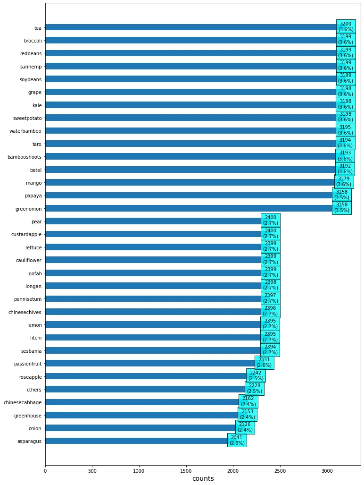
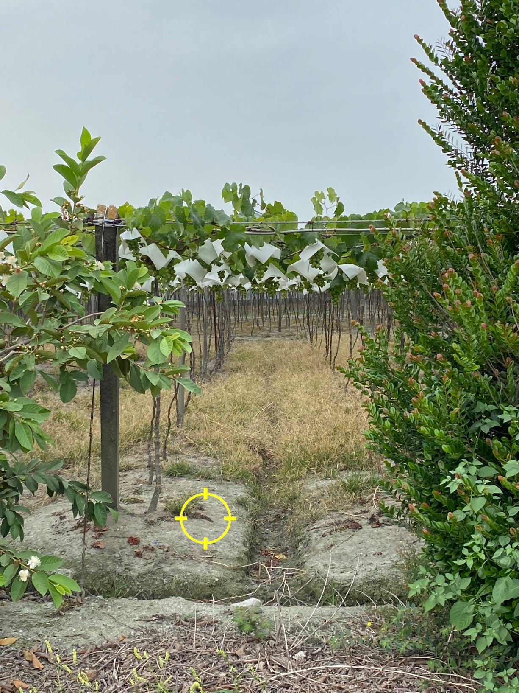

# Analysis

## Analysis Dataset

提取資料的 EXIF 屬性，並進行初步統計分析，可以觀察到這次 33 種類別的分布較春季賽平均



發現原始影像有歪斜問題，使用 EXIF 資訊進行角度修正



```python
def get_angle_from_exif(path):
    image = Image.open(path)
    angle = image._getexif()[274] if (image._getexif() is not None and 274 in image._getexif()) else None
    return angle
data['angle'] = data['path'].apply(lambda x: get_angle_from_exif(x))
data['angle'] = data['angle'].apply(lambda x: {1:0, 3:180, 6:270, 8:90}[x] if x in [1, 3, 6, 8] else x)
```

## Apriori

對最佳預測結果進行錯誤類別的關聯分析，檢查錯誤類別的混淆情況

分析結果儲存在 [`association_rules.csv`](./association_rules.csv) 


| items                       | support  | ordered_statistics                                 |
| :-------------------------- | -------- | :------------------------------------------------- |
| \[broccoli, cauliflower\]   | 0.010331 | \[OrderedStatistic(items_base=frozenset({'brocc... |
| \[greenonion, onion\]       | 0.004831 | \[OrderedStatistic(items_base=frozenset({'green... |
| \[litchi, longan\]          | 0.00446  | \[OrderedStatistic(items_base=frozenset({'litch... |
| \[kale, cauliflower\]       | 0.00327  | \[OrderedStatistic(items_base=frozenset({'cauli... |
| \[chinesecabbage, lettuce\] | 0.003122 | \[OrderedStatistic(items_base=frozenset({'chine... |
