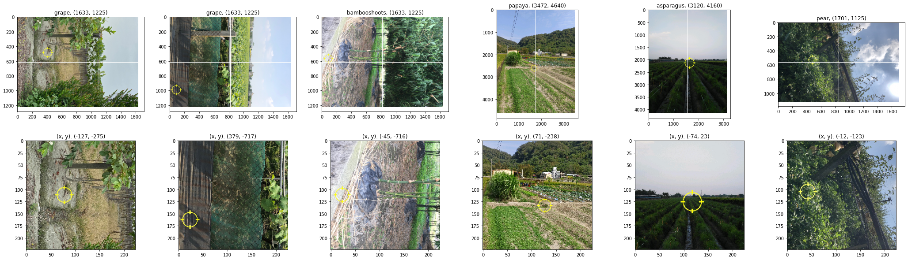

# Image

進行影像資料前處理方法的研究

## image_data_augmentation

```python
def get_augmentation():
    augmentation = tf.keras.models.Sequential()
    # augmentation.add(tf.keras.layers.RandomContrast(factor=0.15))
    augmentation.add(tf.keras.layers.RandomFlip('horizontal_and_vertical'))
    # augmentation.add(tf.keras.layers.RandomZoom(0.15, 0.15))
    augmentation.add(tf.keras.layers.RandomTranslation(height_factor=0.15, width_factor=0.15))
    augmentation.add(tf.keras.layers.RandomRotation(factor=0.15))
    return augmentation
```

使用 tensorflow 的 augmentation layer 進行影像增強，但用於訓練模型後績效未提升

| experiment                                                                                                   | train.precision | valid.precision | test.precision |
| :----------------------------------------------------------------------------------------------------------- | --------------- | --------------- | -------------- |
| subset_224_efficientnetb3_transfer_trainable_epochs100_batchsize256_lr0.0005_reducelr_dropout20              | 1.0000          | 0.6916          | 0.6637         |
| subset_224_efficientnetb3_transfer_trainable_datagen_epochs100_batchsize256_lr0.0005_reducelr_dropout20     | 0.9851          | 0.6741          | 0.6527         |

推測因為原始影像大多僅往 -90 (+270) 度傾斜，使得 `RandomRotation` 與 `RandomFlip` 相對之下產生過多無用樣本


## image_crop

以官方提供的 `target_x` 與 `target_y` 為影像中心點進行裁切，使影像更聚焦在作物上面

可以觀察到官方的 x, y 設定似乎給反



在早期的實驗中，將影像中心點設為 `0, 0` 進行裁切，結果顯示裁切比例 70% 擁有最好績效

| experiment                                                                                                                         | valid.precision | test.precision |
| :--------------------------------------------------------------------------------------------------------------------------------- | --------------- | -------------- |
| subset_224_crop70_efficientnetb3_transfer_trainable_epochs100_batchsize256_lr0.0005_reducelr_dropout40                             | 0.7168          | 0.6849         |
| subset_224_efficientnetb3_transfer_trainable_epochs100_batchsize256_lr0.0005_reducelr_dropout40                                    | 0.7200          | 0.6833         |
| subset_224_crop80_efficientnetb3_transfer_trainable_epochs100_batchsize256_lr0.0005_reducelr_dropout40                             | 0.7148          | 0.6804         |
| subset_224_crop60_efficientnetb3_transfer_trainable_epochs100_batchsize256_lr0.0005_reducelr_dropout40                             | 0.7076          | 0.6798         |
| subset_224_crop50_efficientnetb3_transfer_trainable_epochs100_batchsize256_lr0.0005_reducelr_dropout40                             | 0.6995          | 0.6712         |
| subset_224_crop30_efficientnetb3_transfer_trainable_epochs100_batchsize256_lr0.0005_reducelr_dropout40                             | 0.6580          | 0.6535         |

將影像中心點設為 `target_x` 與 `target_y` 後則沿用這個 70% 的比例設定

實驗 `crop70` 表示將影像中心點設為 `0, 0` 進行裁切；實驗 `crop70xy` 表示將影像中心點設為 `target_x` 與 `target_y` 進行裁切，雖然實驗結果顯示 `crop70` 優於 `crop70xy`，但因為後者邏輯較合理且誤差還在隨機變動的容許範圍內，最終仍採用後者的作法

| experiment                                                                                                               | valid.precision | test.precision |
| :----------------------------------------------------------------------------------------------------------------------- | --------------- | -------------- |
| subset_224_crop70_efficientnetb3_transfer_trainable_epochs100_batchsize256_lr0.0005_reducelr_dropout40                   | 0.7168          | 0.6849         |
| subset_224_crop70xy_efficientnetb3_transfer_trainable_epochs100_batchsize256_lr0.0005_reducelr_dropout40                 | 0.6992          | 0.6812         |
## image_angle_correction_by_model

使用 [RotNet](https://github.com/d4nst/RotNet) 修正影像角度

每個類別隨機抽選 10 張影像，比較原始影像與套用 RotNet 角度修正後的影像

下圖以 asparagus 類別為例，可以發現第 3 張往 -90 (+270) 度傾斜的影像被正確修正，但第 9, 10 張影像卻被過度調整，反而往 -180 (+180) 度傾斜，第 2, 5 張影像也有輕度歪斜


使用肉眼標記修正結果，計算修正成效如下表，套用 RotNet 後，往 -90 (+270) 度歪斜的影像減少，但往 -180 (+180) 度及 -270 (+90) 度歪斜的影像增加，使得 precision、recall 與 f1-score 表現皆不理想

肉眼標記的修正結果記錄在檔案 `train_image_angle_mark_sample.csv` 的 `correct.model` 欄位

|              | precision | recall   | f1-score | support  |
| ------------ | --------- | -------- | -------- | -------- |
| 0            | 0.735931  | 0.691057 | 0.712788 | 246      |
| 90           | 0.030303  | 0.2      | 0.052632 | 5        |
| 180          | 0         | 0        | 0        | 1        |
| 270          | 0.133333  | 0.051282 | 0.074074 | 78       |
| accuracy     | 0.530303  | 0.530303 | 0.530303 | 0.530303 |
| macro avg    | 0.224892  | 0.235585 | 0.209873 | 330      |
| weighted avg | 0.580577  | 0.530303 | 0.549657 | 330      |

使用修正後影像訓練模型的績效也不太理想，低於原先最佳績效

| experiment | valid.precision | test.precision |
| :------------------------------- | --------------- | -------------- |
| subset_224_efficientnetb3_transfer_trainable_epochs100_batchsize256_lr0.0005_reducelr_dropout40 | 0.7200 | 0.6833 |
| subset_224_correct_efficientnetb3_transfer_trainable_epochs100_batchsize256_lr0.0005_reducelr_dropout40 | 0.6997 | 0.6739 |

## image_angle_correction_by_rule

根據 [影像的 EXIF 資訊](https://stackoverflow.com/questions/13872331/rotating-an-image-with-orientation-specified-in-exif-using-python-without-pil-in) 修正角度

每個類別隨機抽選 10 張影像，比較原始影像與套用 EXIF 規則修正後的影像

下圖以 asparagus 類別為例，可以發現第 3 張往 -90 (+270) 度傾斜的影像被正確修正，但第 5 張影像被修正錯誤，這可能是因為 EXIF 資訊不準確

然而綜觀全部 33 種類別，上述因為 EXIF 資訊不準確而修正錯誤的情況屬罕見


使用肉眼標記修正結果，計算修正成效如下表，結果 precision、recall 與 f1-score 皆大於 90%，顯示效果不錯

肉眼標記的修正結果記錄在檔案 `train_image_angle_mark_sample.csv` 的 `correct.rule` 欄位

|              | precision | recall   | f1-score | support  |
| ------------ | --------- | -------- | -------- | -------- |
| 0            | 0.946721  | 0.939024 | 0.942857 | 246      |
| 90           | 1         | 0        | 0        | 5        |
| 180          | 1         | 0        | 0        | 1        |
| 270          | 0.813953  | 0.897436 | 0.853659 | 78       |
| accuracy     | 0.912121  | 0.912121 | 0.912121 | 0.912121 |
| macro avg    | 0.940169  | 0.459115 | 0.449129 | 330      |
| weighted avg | 0.916309  | 0.912121 | 0.904631 | 330      |

使用修正後影像訓練模型的績效稍微高於原先最佳績效

再結合 70% 裁切法後，在 test 資料集的 precision 提升至 0.7114，相較僅裁切影像或僅修正角度提升約 0.03 績效，顯示兩種影像處理方法確實對模型訓練有幫助，且彼此有加成效果，故在後續實驗固定這兩種前處理方法

| experiment                                                                                                               | valid.precision | test.precision |
| :----------------------------------------------------------------------------------------------------------------------- | --------------- | -------------- |
| subset_224_crop70xy_correct_by_rule_efficientnetb3_transfer_trainable_epochs100_batchsize256_lr0.0005_reducelr_dropout40 | 0.7220          | 0.7114         |
| subset_224_correct_by_rule_efficientnetb3_transfer_trainable_epochs100_batchsize256_lr0.0005_reducelr_dropout40          | 0.7112          | 0.6871         |
| subset_224_efficientnetb3_transfer_trainable_epochs100_batchsize256_lr0.0005_reducelr_dropout40                          | 0.7200          | 0.6833         |
| subset_224_crop70xy_efficientnetb3_transfer_trainable_epochs100_batchsize256_lr0.0005_reducelr_dropout40                 | 0.6992          | 0.6812         |

