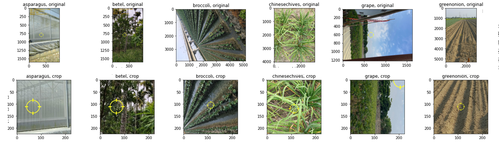
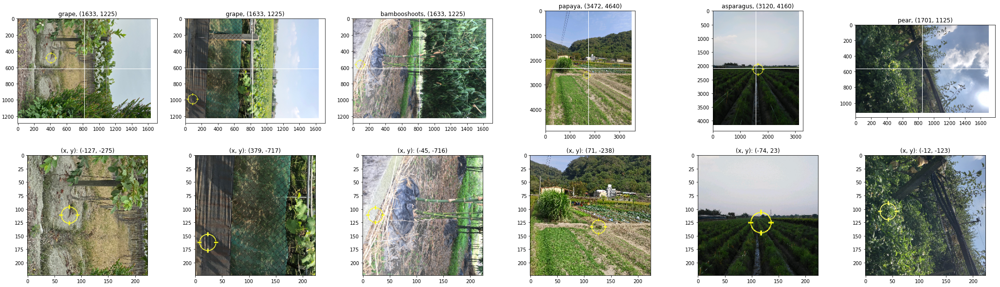
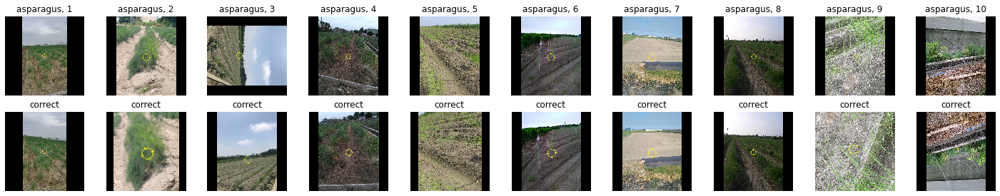
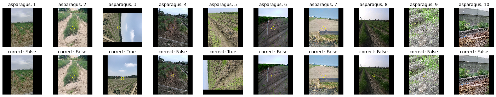

# Image

進行影像資料前處理方法的研究

## Data Augmentation: Keras

| item | experiment                                                                                              | train.precision | valid.precision | test.precision |
| ---- | :------------------------------------------------------------------------------------------------------ | --------------- | --------------- | -------------- |
| 1    | subset_224_efficientnetb3_transfer_trainable_epochs100_batchsize256_lr0.0005_reducelr_dropout20         | 1.0000          | 0.6916          | 0.6637         |
| 2    | subset_224_efficientnetb3_transfer_trainable_datagen_epochs100_batchsize256_lr0.0005_reducelr_dropout20 | 0.9851          | 0.6741          | 0.6527         |


```python
def get_augmentation():
    augmentation = tf.keras.models.Sequential()
    # augmentation.add(tf.keras.layers.RandomContrast(factor=0.15))
    augmentation.add(tf.keras.layers.RandomFlip('horizontal_and_vertical'))
    # augmentation.add(tf.keras.layers.RandomZoom(0.15, 0.15))
    augmentation.add(tf.keras.layers.RandomTranslation(height_factor=0.15, width_factor=0.15))
    augmentation.add(tf.keras.layers.RandomRotation(factor=0.15))
    return augmentation
```

使用 tensorflow.keras 的影像處理層進行資料增強，但用於訓練模型後績效未提升


推測因為原始影像大多僅往 -90 (+270) 度傾斜，使得 `RandomRotation` 與 `RandomFlip` 相對之下產生過多無用樣本


程式實作參考 [image_data_augmentation.ipynb](./image_data_augmentation.ipynb)

## Image Crop by Origin

| item | experiment                                                                                             | valid.precision | test.precision |
| ---- | :----------------------------------------------------------------------------------------------------- | --------------- | -------------- |
| 10   | subset_224_crop70_efficientnetb3_transfer_trainable_epochs100_batchsize256_lr0.0005_reducelr_dropout40 | 0.7168          | 0.6849         |
| 11   | subset_224_crop80_efficientnetb3_transfer_trainable_epochs100_batchsize256_lr0.0005_reducelr_dropout40 | 0.7148          | 0.6804         |
| 9    | subset_224_crop60_efficientnetb3_transfer_trainable_epochs100_batchsize256_lr0.0005_reducelr_dropout40 | 0.7076          | 0.6798         |
| 8    | subset_224_crop50_efficientnetb3_transfer_trainable_epochs100_batchsize256_lr0.0005_reducelr_dropout40 | 0.6995          | 0.6712         |
| 7    | subset_224_crop30_efficientnetb3_transfer_trainable_epochs100_batchsize256_lr0.0005_reducelr_dropout40 | 0.6580          | 0.6535         |

嘗試以圖像中心 `0, 0` 為原點點，向外進行不同比例的裁切，下圖是將裁切比例設為 50% 的範例



先根據設定的比例裁切後，再縮放至 224px x 224px，舉例來說：原始尺寸 1000px x 1000px 的影像套用 50% 裁切比例，就會先裁切至 500px x 500px，再縮放至 224px x 224px

結果顯示裁切比例 70% 擁有最好的績效

程式實作參考 [image.py](../utils/image.py) 及 [image_crop.ipynb](./image_crop.ipynb)

## Image Crop by XY

| item | experiment                                                                                               | valid.precision | test.precision |
| :--- | :------------------------------------------------------------------------------------------------------- | --------------- | -------------- |
| 10   | subset_224_crop70_efficientnetb3_transfer_trainable_epochs100_batchsize256_lr0.0005_reducelr_dropout40   | 0.7168          | 0.6849         |
| 17   | subset_224_crop70xy_efficientnetb3_transfer_trainable_epochs100_batchsize256_lr0.0005_reducelr_dropout40 | 0.6992          | 0.6812         |

以官方提供的 `target_x` 與 `target_y` 為中心點進行影像裁切，使影像更聚焦在作物上面；而由於在[先前的實驗](#Image-Crop-by-Origin)顯示將裁切比例設為 70% 擁有最好績效，故這個階段沿用該設定，下圖是將裁切比例設為 70% 的範例



項目 10 表示用原始中心點進行裁切的實驗，項目 17 則表示用 `target_x` 與 `target_y` 為中心點進行裁切的實驗，雖然實驗結果顯示項目 10 的績效較項目 17 好，但因為後者的邏輯較合理且誤差還在隨機變動的容許範圍內，最終仍決定保留後者的作法

程式實作參考 [image.py](../utils/image.py) 及 [image_crop.ipynb](./image_crop.ipynb)

## Image Angle Correction by RotNet

| item | experiment                                                                                              | valid.precision | test.precision |
| ---- | :------------------------------------------------------------------------------------------------------ | --------------- | -------------- |
| 4    | subset_224_efficientnetb3_transfer_trainable_epochs100_batchsize256_lr0.0005_reducelr_dropout40         | 0.7200          | 0.6833         |
| 6    | subset_224_correct_efficientnetb3_transfer_trainable_epochs100_batchsize256_lr0.0005_reducelr_dropout40 | 0.6997          | 0.6739         |

從[前面的分析](#Data-Augmentation-Keras)得知原始影像大多往 -90 (+270) 度傾斜，故決定往影像角度修正的方向研究

這裡使用 [RotNet](https://github.com/d4nst/RotNet) 的預訓練模型判斷影像角度進行修正，再以修正後的影像資料訓練模型，項目 6 表示使用修正後影像訓練之模型的實驗，結果低於原先最佳績效，顯示不套用修正比較好

為分析方法無效的原因，在每個類別隨機抽選 10 張影像，比較原始影像與套用 RotNet 修正後的影像

下圖以 asparagus 類別為例，可以發現第 3 張往 -90 (+270) 度傾斜的影像被正確修正，但第 9, 10 張影像卻被過度調整，反而往 -180 (+180) 度傾斜，第 2, 5 張影像也有輕度歪斜



使用肉眼標記修正結果，計算修正成效如下表，第 1 欄表示角度，第 2 欄表示原始資料裡面特定角度的影像數量（正確答案），第 3 欄表示 RotNet 判斷影像屬於特定角度的數量（預測結果），可以發現往 -180 (+180) 度及 -270 (+90) 度歪斜的影像大幅度增加

| angle | counts: original | counts: correct-by-model |
| ----- | ---------------- | ------------------------ |
| 0     | 246              | 231                      |
| 90    | 5                | 33                       |
| 180   | 1                | 36                       |
| 270   | 78               | 30                       |

肉眼標記的修正結果記錄在檔案 `train_image_angle_mark_sample.csv` 的 `correct.model` 欄位

程式實作參考 [RotNet](https://github.com/d4nst/RotNet) 及 [image_angle_correction_by_model.ipynb](./image_angle_correction_by_model.ipynb)

## Image Angle Correction by Rule

| item | experiment                                                                                                               | valid.precision | test.precision |
| :--- | :----------------------------------------------------------------------------------------------------------------------- | --------------- | -------------- |
| 20   | subset_224_crop70xy_correct_by_rule_efficientnetb3_transfer_trainable_epochs100_batchsize256_lr0.0005_reducelr_dropout40 | 0.7220          | 0.7114         |
| 19   | subset_224_crop70_correct_by_rule_efficientnetb3_transfer_trainable_epochs100_batchsize256_lr0.0005_reducelr_dropout40   | 0.7288          | 0.7060         |
| 18   | subset_224_correct_by_rule_efficientnetb3_transfer_trainable_epochs100_batchsize256_lr0.0005_reducelr_dropout40          | 0.7112          | 0.6871         |
| 10   | subset_224_crop70_efficientnetb3_transfer_trainable_epochs100_batchsize256_lr0.0005_reducelr_dropout40                   | 0.7168          | 0.6849         |
| 17   | subset_224_crop70xy_efficientnetb3_transfer_trainable_epochs100_batchsize256_lr0.0005_reducelr_dropout40                 | 0.6992          | 0.6812         |

先前[透過模型判斷角度](#Image-Angle-Correction-by-RotNet)的成果不太好，這次則根據[影像的 EXIF 資訊](https://stackoverflow.com/questions/13872331/rotating-an-image-with-orientation-specified-in-exif-using-python-without-pil-in)修正角度，項目 18 是實驗結果，可以發現績效比起先前最佳的項目 10 及項目 17 都更好

將項目 18 的角度修正結合項目 10 的[原點裁切](#Image-Crop-by-Origin)得到項目 19，結合項目 17 的 [XY 裁切](#Image-Crop-by-XY)得到項目 20，結果顯示 2 組實驗的績效都得到提升，表示角度修正與影像裁切確實對模型訓練有幫助，且彼此有加成效果，故在後續實驗固定這 2 種前處理方法

從 EXIF 取得的角度是設備在拍攝當下自動判斷的角度，比例不高但仍有出錯的可能；為解釋修正方法的有效性，同樣在每個類別隨機抽選 10 張影像，比較原始影像與套用 EXIF 規則修正後的影像

下圖以 asparagus 類別為例，可以發現第 3 張往 -90 (+270) 度傾斜的影像被正確修正，但第 5 張影像被修正錯誤，這可能是因為 EXIF 資訊不準確，然而綜觀全部 33 種類別，上述因為 EXIF 資訊不準確而修正錯誤的情況屬罕見



使用肉眼標記修正結果，計算修正成效如下表，第 1 欄表示角度，第 2 欄表示原始資料裡面特定角度的影像數量（正確答案），第 3 欄表示 EXIF 判斷影像屬於特定角度的數量（預測結果）
，可以發現 EXIF 判斷的角度數量與正確答案非常接近

| angle | counts: original | counts: correct-by-rule |
| ----- | ---------------- | ----------------------- |
| 0     | 246              | 244                     |
| 90    | 5                | 0                       |
| 180   | 1                | 0                       |
| 270   | 78               | 86                      |

肉眼標記的修正結果記錄在檔案 `train_image_angle_mark_sample.csv` 的 `correct.rule` 欄位

程式實作參考 [image.py](../utils/image.py) 及 [image_angle_correction_by_model.ipynb](./image_angle_correction_by_model.ipynb)